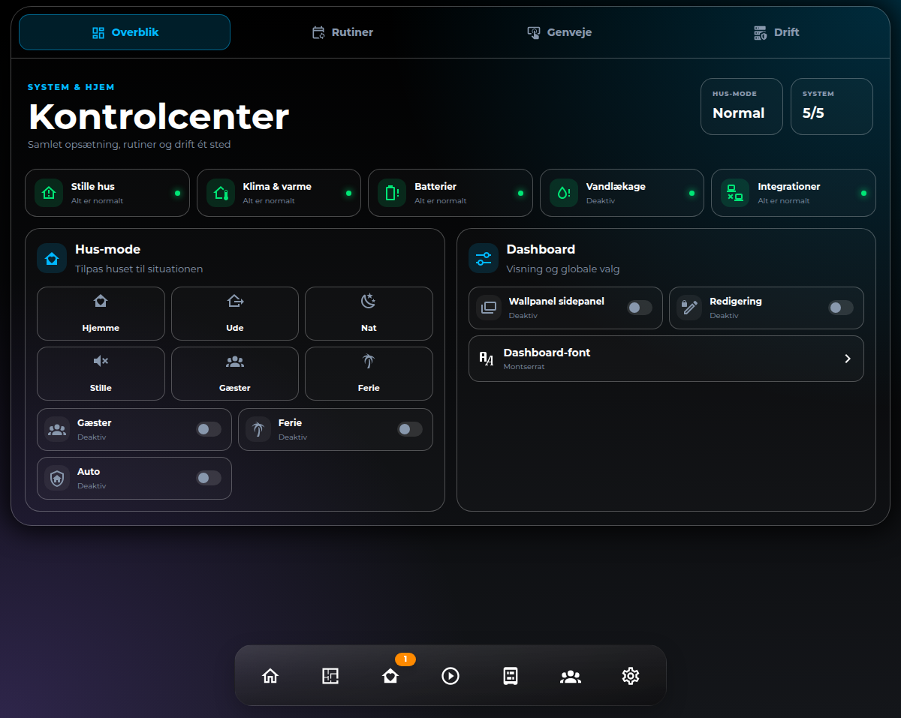

# HA Settings Center Card

Et samlet, responsivt kontrolcenter til Home Assistant med faner til overblik, rutiner, direkte styring og drift.



## Funktioner

- Systemstatus og hus-mode i ét overblik
- Toggle-grupper til automations, helpers, lys, maskiner og øvrige funktioner
- Talstyring med plus/minus og valgfri live-sensorværdi
- Direkte adgang til input-select og input-datetime via Home Assistants dialog
- Samlet sceneopsætning med lysstyrke og farve
- Driftstal og handlinger med bekræftelse ved kritiske kommandoer
- Stabil fanenavigation, som ikke afbrydes af Home Assistants state-opdateringer
- Responsivt layout uden vandret overflow
- GUI-editor til titel og avanceret JSON-konfiguration
- Home Assistant-temavariabler med sikre fallback-farver

## Installation

Tilføj repositoryet som et brugerdefineret HACS frontend-repository, eller kopiér JavaScript-filen til `/config/www/ha-settings-center-card` og tilføj:

```yaml
url: /local/ha-settings-center-card/ha-settings-center-card.js
type: module
```

Resource-typen skal være `module` (fjern bindestregen foran `type` i en manuel resource-dialog).

## Grundeksempel

```yaml
type: custom:ha-settings-center-card
title: Kontrolcenter
default_tab: overview
overview:
  status_items:
    - entity: sensor.system_issue_count
      name: System
      icon: mdi:server-security
  mode:
    entity: input_select.house_mode
    options:
      - value: Normal
        name: Hjemme
        icon: mdi:home-heart
  dashboard_items:
    - entity: input_boolean.kiosk_mode
      name: Kiosk
automation_groups:
  - title: Presence
    icon: mdi:motion-sensor
    kind: toggle
    items:
      - entity: automation.room_presence
        name: Stuen
```

Grupper understøtter `kind: toggle`, `kind: number` og `kind: entity`. Antallet af grupper og elementer skalerer automatisk.

## Licens

MIT
